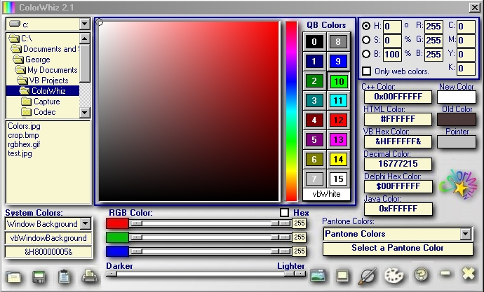



## Colorwhiz

### Description

ColorWhiz 2.1 is an easy to use color capture and code conversion utility for web designers,

graphics creators and developers. The program allows users to easily capture and mix colors.

Users are able to capture a color from any portion of the screen supported by a magnifying

tool. The captured color is instantly converted to various programming codes,which can then

be copied to the clipboard for us in other applications. ColorWhiz has a built in screen

capture utility and allows the creation and saving of a custom pallette as well.

Color codes displayed in different formats (HSB,RGB,CMYK,HTML,VB HEX,DECIMAL,C++,JAVA,

DELPHI,PANTONE AND SYSTEM)
 
### More Info
 

             |
---                |---
**Submitted On**   |2010-08-13 20:21:42
**By**             |[Winwhiz](https://github.com/Planet-Source-Code/PSCIndex/blob/master/ByAuthor/winwhiz.md)
**Level**          |Advanced
**User Rating**    |4.8 (24 globes from 5 users)
**Compatibility**  |VB 6\.0
**Category**       |[Graphics](https://github.com/Planet-Source-Code/PSCIndex/blob/master/ByCategory/graphics__1-46.md)
**World**          |[Visual Basic](https://github.com/Planet-Source-Code/PSCIndex/blob/master/ByWorld/visual-basic.md)
**Archive File**   |[Colorwhiz2186218132010\.zip](https://github.com/Planet-Source-Code/winwhiz-colorwhiz__1-73334/archive/master.zip)

